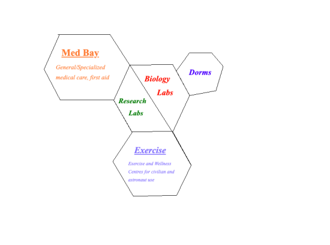
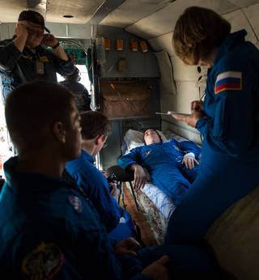
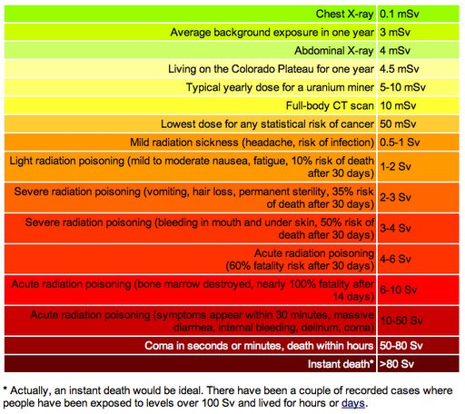

# Medical Wing
## Overview
The medical wing of our settlement is made up of 3 main components, which are as follows: med bay, biology/research laboratories, and the fitness and exercise centers. All of these elements are crucial in maintaining the wellbeing of our astronauts and citizens throughout the revolutionary journey. As is obvious, the med bay contains the most important sections of this wing, containing technologies, treatments and medications that will be used for both first aid and regular care. Labs are key for discovering and monitoring the effects of microgravity and Martian conditions on the human body, which is a main area of research during this mission. Finally, the fitness section of our annexe prevents further deterioration of systems in the body, maintaining the health of all residents. 

### Known effects of microgravity and space travel on humans

<table>
<tr>
  <td><b>Common effects</b></td>
  <td><b>Rare effects (worst case scenarios)</b></td>
</tr>
  
<tr>  
  <td>Puffiness in face and 10%-30% decrease in leg circumference</td>
  <td>Kidney Stones</td>
</tr>
<tr>
  <td>Nasal stuffiness and/or eye abnormalities</td>
  <td>Increased risk of cancer</td>
  </tr>
<tr>
  <td>Reduction of red blood cells</td>
  <td>Increased risk of osteoporis-related fractures</td>
  </tr>
<tr>
  <td>Profound muscle atrophy</td>
  <td>Affected hand-eye and head-eye coordnation issues, along with problems involving spatial awareness and balance</td>
  </tr>
<tr>
  <td>Demineralization of skeleton/decrease in bone density (osteopenia)</td>
  <td>Increased risk of depression</td>
  </tr>
<tr>
  <td>Motion sickness/disorientation</td>
  <td>Radiation sickness (characterized by nausea, vomiting, anorexia and fatigue)</td>
  </tr>
<tr>
  <td>Shallow or disturbed sleep cycles</td>
  <td>Possible damage to the nervous system, causing altered cognitive function, reduced motor function and behavioral changes</td>
</tr>
</table>

 
### Dangers to citizen/astronaut safety 
#### Space Radiation
Space radiation is a huge threat to the wellfare of human beings, causing (as shown above) radiation sickeness, along with an increased risk of cancer. This radiation comes in 3 main forms: particles trapped in Earth's magnetic field, particles shot into space during solar flares, and galatic cosmic rays (a mix of high-energy protons and heavy ions from outside of our solar system). This radiation comes from many sources, such as elements in Earth's crust, stars and other astrophysical objects, but the main culprit is our Sun. The flaming ball of gas emits all 7 wavelengths of the elctromagnetic spectrum (radiowaves, microwaves, infrared, visible light, ultraviolet, x-rays and gamma rays). During a soalr flare, copious amounts of radiation is released (called a solar particle event, or an SPE) in the forms of x-rays, gamma rays, protons and electrons.
One very common measurement for radiation is a milli-sievert, (or a sievert, and 1000 mSv equals 1 Sv) and astronauts are exposed to an average of 50 mSv to 2,000 mSv, a dangerous amount equilvalent to 150 to 6,000 chest x-rays (1,000 mSv causes fatal cancer in 5% of people, and is the limit for an astronaut's exposure throughout their career).

#### Spacesuit malfunctions
The spacesuits generally used for EVA (extravehicular activities) are called EMUs (Extravehicular Mobility Units). These  bulky, white uncomfortable suits have a long way to go for form, yet still provide constant life support thrughout an expidition, along wth atmospheric containment, thermal insulation, cooling, solar radiation protection, and protection from micrometeoroids and orbital debris (MMOD). They are maintained at a slightly lower pressure than the ISS (International Space Station). Malfunctions here are rare but can be incredibly hazardous, if not fatal, to the person wearing it. One of the faults which can occur in EMUs is decompression sickness, or DCS, known as 'the bends' among SCUBA divers. This malady is caused by nitrogen dissolving into tissue and blood becuase of high pressure to the body. It is the result of inadequate denitrogenation before an EVA. To prevent this serious issue, astronauts breathe 100% oxygen while in the suit. 

[Normal Heartbeat](https://www.asc-csa.gc.ca/videos/StNoBubshort.wav)

[DCS Heartbeat](https://www.asc-csa.gc.ca/videos/StManyBubshort.wav)

#### Cardiovascular and Osteopathic Deteorioration/Dysfunction
One potential threat to the wellness of all inhabitants is the decline of systems in the body, the main two being skeletal and cardiovascular. Bones will decrease in density from 1%-2% per month, significantly raising the risk for osteopenia, osteoporosis, and osteoporosis-related fractures later in life. As for the cardiovascular system, once in space, a cephalad fluid shift occurs (fluid from the lower portions of the body move to the upper portions), so muscles and arteries are no longer as heartily worked, causing a decreased ability to control blood pressure, and a redcution in the size and strength of the cardiac muscles. Without proper treament, these ailments will inevitably worsen over time spent in microgravity. 

## Sections of the Wing

### Med Bay
The Med bay is the main section of this wing, providing first aid, general medical care and specialized care for all astronauts and citizens. The bay will be stocked with critical equpiment such as MRI/CAT scanners, defibrillators, portable ultrasounds, EKGs (electrocardiogram), and binocular indirect ophthalmoscopes, used for seeing directly inside a human eye, along with the necessary medications, sterilizers, anesthetics, and saline solutions. 

### Biology/Research Laboratories
During our expedition, our scientists must take the invaluable chance to research and collect information about our red planet. The labs in this wing will be mainly focused on the chemitry and biology aspects of the data gathering for Mars.
We will begin monitoring the symptoms of extended stays in Mars' microgravity, along with the effects of the significantly higher space radiation levels (approximately 11-12 mSv per day, a large difference from Canada's 1.8 mSv per year) on the human body, crucial research if others plan to follow in these footsteps. Research will also be conducted on the perchlorate compounds in Mars' dangerous and toxic soil. Perchlorate refers to the fact that these compounds contain elemntal chlorine, incredibly rare in it's purest forms (it takes the form of a yellow-green gas when at room temperature). These specialized laboratories are necessary, since elemental chlorine is also incredibly dangerous, causing a buildup of both hydrochloric and hydrochlorous acid inside the body, along with pulmenary edema (fluid inside the lungs), and severe burns, some reasons why it was used in chemical warfare during WW1. This chemical also can cause explosive reactions when exposed to substances such as turpentine or ammonia. Another researchable chemical found on Mars' surface is fluorine, in amounts of 32 ppm (parts per million) vs Earth's 19.4 ppm. Fluorine reacts with every element except for argon, neon and helium. Low concentrations of the gas cause nose and eye irratations, whereas high concentrations causes tooth decay, osteoporosis, damage to the kidneys, bones, nerves and muscles, and can sometimes be fatal.

### Fitness and Exercise Centers
Whenever space travel is an option, there are dangers. There are immediate dangers, of course, but also slower declines into disease and malady. As stated above, the bones and cardiac muscles in one's body deteriorate without proper treatment. The most effective treatment found is constant exercise, which prevents the systems from atrophying and sending one into a medical downwards spiral. Before and after launch, astronauts work out for an average of two hours per day, a pattern which protects them from losing density and minerals in the bones and also prevents the repercussions of the cephalad fluid shift.

<a href = "https://lgrunewa7301.github.io/" target = "self">
Back to hub
</a>
