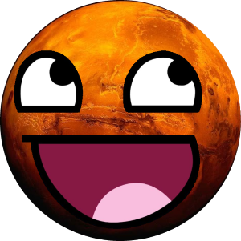
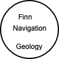
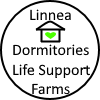

# Welcome to our Mars Base!

- [Abby's Page](AB_page.md)
- [Linnea's Page](Linnea-main.md)
- [Jacob's Page](Jacobmain.md)
- [Matthew's Page](mattspage.md)
- [Nate's Page](Nates_page.md)
- [Finn's Page](finn-main.md)

(The base is underground. You might not be able to see it.)

# Development tools
### `(Will be removed before anyone outside the development team sees this website.)`
- [ReadMe - general information](README.md)
- [Sandbox](sandbox.md)
